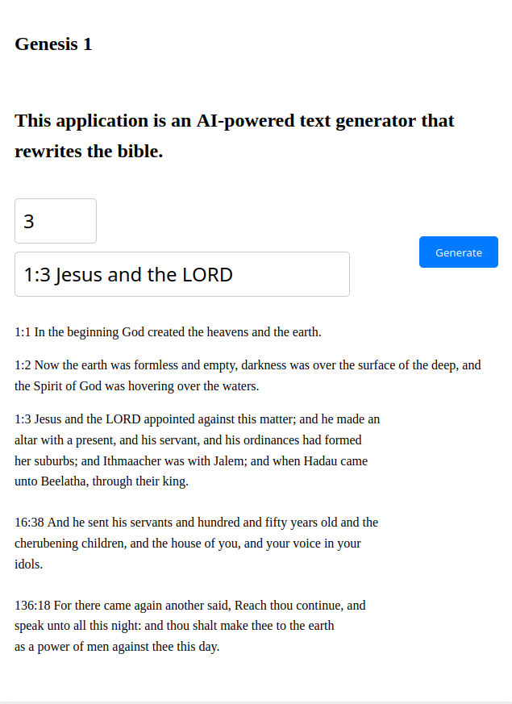

This is GPTesus, a generator of holy verse. It was trained on the holy Bible to share more of its Truth. 

It's based on the project from nanoGPT project from the saint Karparthy (https://github.com/karpathy/nanoGPT)

# How to know the Truth

## By the website 
You can go on the holy website, insert how many verses you want and the begining of the first verse. 

## In local
You can also clone the code : 
`$ git clone https://github.com/NLeboucher/GPTesus.git`
`$ cd GPTesus/web`
`$ python -m http.server`

#### Website 
Open the index.html file on your browser. 

#### In the terminal
`$ python3.10 sample.py --out_dir=out-psychology-char`

## Train
You can also use this model to train it on other holy books. Change 
`$ python train.py config/train_psychology.py`